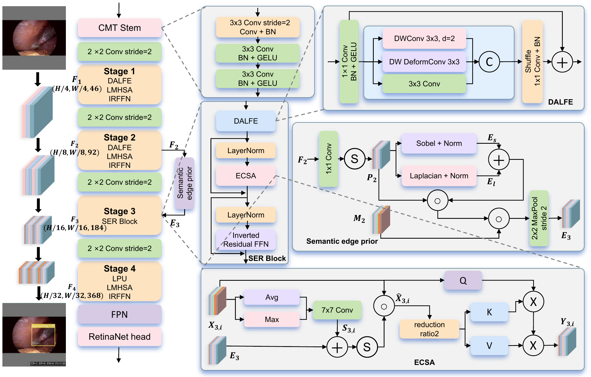
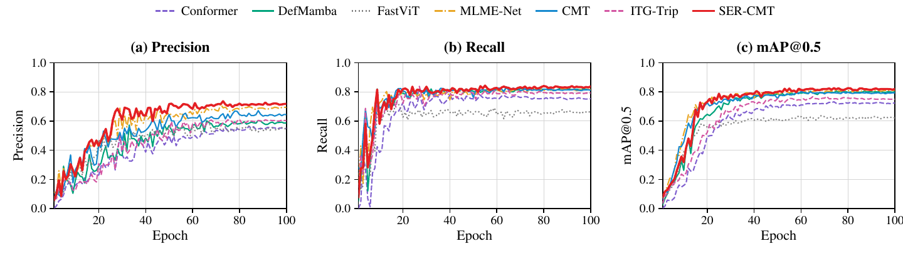
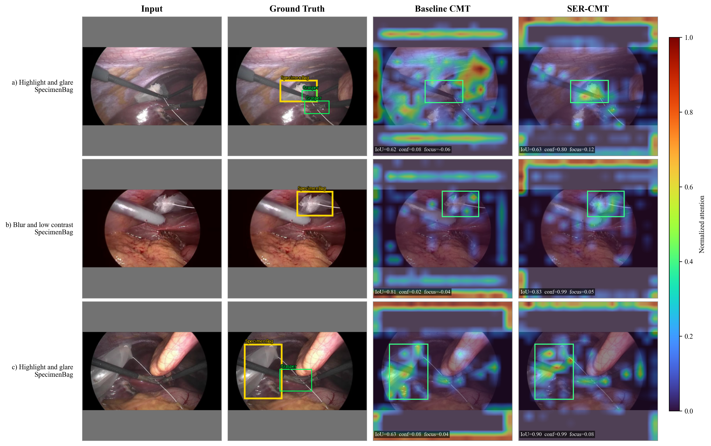
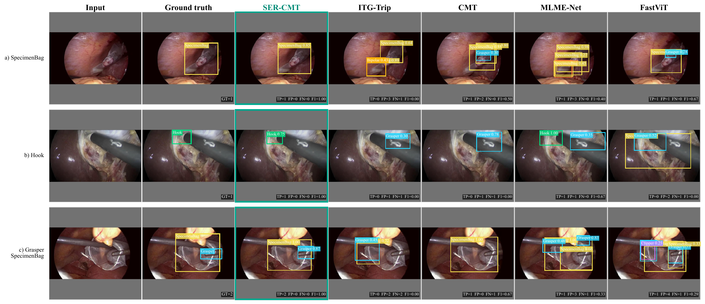

# SER-CMT

**Degradation-Adaptive Local Enhancement and Semantic Edge-Guided Structural Reasoning for Surgical Instrument Detection**

Official PyTorch implementation of **SER-CMT (Surgical Edge-Robust CMT)** for surgical instrument detection on M2CAI16-Tool-Locations.

SER-CMT is built on CMT-Ti and targets two recurring difficulties in laparoscopic scenes:

- local appearance degradation caused by glare, blur, blood contamination, and low contrast;
- discontinuous instrument evidence caused by partial occlusion and instrument overlap.

The model retains the four-stage CMT-Ti hierarchy, FPN, and RetinaNet detector. It introduces Degradation-Adaptive Local Feature Enhancement (DALFE), a semantic edge prior, and Edge-Conditioned Structural Attention (ECSA).

<p align="center">
  
</p>

## Architecture

The CMT-Ti depths remain **(2, 2, 10, 2)**, with channel widths **(46, 92, 184, 368)**.

| Stage | Output | Repeats | Block |
|---|---:|---:|---|
| Stage 1 | 80 × 80 × 46 | 2 | DALFE + LMHSA + IRFFN |
| Stage 2 | 40 × 40 × 92 | 2 | DALFE + LMHSA + IRFFN |
| Stage 3 | 20 × 20 × 184 | 10 | DALFE + ECSA + IRFFN |
| Stage 4 | 10 × 10 × 368 | 2 | LPU + LMHSA + IRFFN |

### DALFE

DALFE combines three complementary branches after a 1 × 1 projection:

- a 3 × 3 texture branch for fine local detail;
- a dilated depthwise branch for enlarged context;
- a depthwise deformable branch for elongated and oblique instrument geometry.

The branch features are concatenated, channel-shuffled, projected, and added to the input through a residual connection.

### Semantic edge prior

The completed Stage 2 feature is projected to a one-channel semantic map. Fixed Sobel and Laplacian operators extract first- and second-order boundaries. Learnable fusion weights combine both responses, semantic gating suppresses unsupported edges, and a valid-region mask attenuates letterbox boundaries. The resulting prior is downsampled once and shared by all ten Stage 3 blocks.

### ECSA

ECSA fuses the current Stage 3 spatial response with the shared edge prior. Its residual modulation is zero-initialized. Queries are generated from the original feature, while keys and values are generated from the structurally enhanced feature. The original CMT head count, key-value reduction, and relative-position bias are retained.

## Repository layout

```text
SER-CMT/
├── cmt.py                 # CMT-Ti backbone definition
├── ser_cmt.py             # DALFE, semantic edge prior, ECSA, and SER-CMT
├── train_m2cai.py         # dataset, evaluation, FPN, and profiling utilities
├── train_ser_cmt.py       # training and test entry point
├── verify_ser_cmt.py      # architecture, forward, backward, and gradient checks
├── assets/                # paper figures used in this README
└── results/               # paper-reported result tables in CSV format
```

Datasets, checkpoints, and run directories are intentionally excluded from Git.

## Installation

The reported experiments used Python 3.9, PyTorch 2.0.1, torchvision 0.15.2, and an NVIDIA RTX 3090.

```bash
conda create -n ser-cmt python=3.9 -y
conda activate ser-cmt

# Install the PyTorch build matching your CUDA runtime first.
pip install torch==2.0.1 torchvision==0.15.2
pip install -r requirements.txt
```

`torchvision.ops.DeformConv2d` must be available for DALFE.

## Dataset

Prepare M2CAI16-Tool-Locations in Pascal VOC form:

```text
m2cai16-tool-locations/
├── Annotations/
│   └── *.xml
├── JPEGImages/
│   └── *.jpg
└── ImageSets/
    └── Main/
        ├── train.txt
        ├── val.txt
        └── test.txt
```

The manuscript split contains 1,405 training, 843 validation, and 563 test frames. The seven classes are Grasper, Bipolar, Hook, Scissors, Clipper, Irrigator, and SpecimenBag.

## Verification

Run the structural and numerical preflight before training:

```bash
python verify_ser_cmt.py --device cuda --output preflight_validation.json
```

The check verifies:

- stage depths `(2, 2, 10, 2)` and feature shapes;
- DALFE and ECSA placement in all ten Stage 3 blocks;
- zero initialization of each ECSA `eta` and `gamma`;
- detector inference, loss computation, backward propagation, and finite gradients.

An existing DALFE checkpoint can also be checked during initialization:

```bash
python verify_ser_cmt.py --device cuda --dalfe-checkpoint /path/to/dalfe_best.pt
```

## Training

The paper protocol uses 320 × 320 inputs, batch size 4, AdamW, learning rate `2e-4`, weight decay `0.05`, cosine decay to `1e-6`, 100 epochs, mixed precision, and seed 42. The full model is initialized from the best DALFE checkpoint.

```bash
python train_ser_cmt.py \
  --dataset /path/to/m2cai16-tool-locations \
  --dalfe-checkpoint /path/to/dalfe_best.pt \
  --seed 42 \
  --epochs 100 \
  --image-size 320 \
  --batch-size 4 \
  --eval-batch-size 4 \
  --workers 4 \
  --lr 2e-4 \
  --weight-decay 0.05 \
  --eta-min 1e-6 \
  --output-dir runs/ser_cmt_seed42
```

Training can start without `--dalfe-checkpoint`, but that is not the initialization used in the manuscript. Resuming from `last.pt` is enabled by default; pass `--no-resume` for a clean run.

Each run stores `best.pt`, `last.pt`, `results.csv`, `metrics.csv`, `config.json`, `model_config.json`, `weight_loading_report.json`, `ecsa_diagnostics.jsonl`, test metrics, and profiling results.

## Results

### Test-set comparison

Mean ± sample standard deviation over three runs under the common RetinaNet detector protocol:

| Method | Precision | Recall | mAP50 | mAP50:95 | Params (M) | FLOPs (G) | FPS |
|---|---:|---:|---:|---:|---:|---:|---:|
| Conformer-Tiny | 0.5291 ± 0.0073 | 0.7811 ± 0.0117 | 0.7403 ± 0.0084 | 0.3409 ± 0.0034 | 24.87 | 23.33 | 61.87 |
| DefMamba-Tiny | 0.5955 ± 0.0098 | 0.8188 ± 0.0141 | 0.8041 ± 0.0116 | 0.4012 ± 0.0084 | 9.15 | 15.08 | 41.66 |
| FastViT-T8 | 0.5390 ± 0.0168 | 0.6495 ± 0.0227 | 0.6206 ± 0.0156 | 0.2648 ± 0.0124 | 5.16 | 13.55 | 49.72 |
| CMT-Ti | 0.6468 ± 0.0101 | 0.7979 ± 0.0201 | 0.7882 ± 0.0180 | 0.3861 ± 0.0127 | 10.85 | 15.25 | 65.12 |
| MLME-Net | 0.6557 ± 0.0152 | 0.8129 ± 0.0016 | 0.8150 ± 0.0143 | 0.4001 ± 0.0039 | 3.95 | 9.30 | 265.00 |
| ITG-Trip | 0.5719 ± 0.0132 | 0.7609 ± 0.0137 | 0.7303 ± 0.0096 | 0.3777 ± 0.0064 | 36.08 | 21.95 | 79.31 |
| **SER-CMT-Ti** | **0.7177 ± 0.0093** | **0.8271 ± 0.0129** | **0.8159 ± 0.0115** | **0.4113 ± 0.0087** | 11.19 | 16.19 | 48.06 |

The machine-readable table is available in [`results/main_results.csv`](results/main_results.csv). All architecture definitions, accuracy values, and efficiency measurements in this repository follow the final manuscript. Dataset files and trained checkpoints are not distributed in this repository.

### Component analysis

Validation results for seed 42:

| Configuration | Best epoch | Precision | Recall | mAP50 | mAP50:95 |
|---|---:|---:|---:|---:|---:|
| CMT-Ti | 88 | 0.6717 | 0.8111 | 0.8040 | 0.4018 |
| + DALFE | 75 | 0.6820 | **0.8472** | **0.8403** | 0.4289 |
| Full SER-CMT | 81 | **0.7287** | 0.8370 | 0.8401 | **0.4293** |

<p align="center">
  
</p>

## Qualitative results

Prediction-conditioned Stage 3 Grad-CAM examples show stronger and more continuous responses on selected glare, low-contrast, and occlusion cases.

<p align="center">
  
</p>

Selected detection examples under the common confidence threshold of 0.25:

<p align="center">
  
</p>

These selected examples illustrate model behavior and are not estimates of its frequency over the complete test set.

## Citation

If this repository is useful in your research, please cite:

```bibtex
@misc{peng2026sercmt,
  title  = {SER-CMT: Degradation-Adaptive Local Enhancement and Semantic Edge-Guided Structural Reasoning for Surgical Instrument Detection},
  author = {Peng, Lihong and Xie, Yunhua},
  year   = {2026},
  url    = {https://github.com/paper-code805/SER-CMT}
}
```

SER-CMT builds on the official CMT implementation by Guo et al. See [`THIRD_PARTY_NOTICES.md`](THIRD_PARTY_NOTICES.md) for attribution.

## Notes

- The M2CAI16-Tool-Locations dataset is not redistributed here. Follow its original access and usage terms.
- Trained checkpoints are not included in the initial code release.
- No project-specific credentials, local datasets, or absolute machine paths are stored in this repository.
